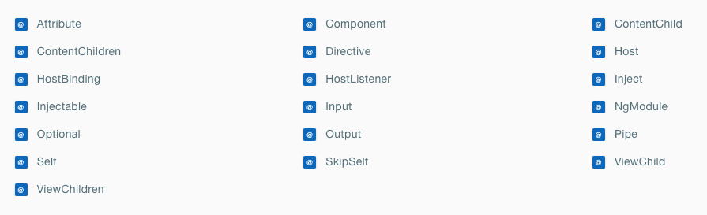

# Angular Meetup #3

Angular Framework verstehen 

Alexander Gräfenstein

---

## Angular

19 Dekoratoren <!-- .element: class="fragment" data-fragment-index="1" -->


<!-- .element: class="fragment" data-fragment-index="1" -->

---

## Was ist ein Decorator?

- ein Typescript Feature (noch) <!-- .element: class="fragment" -->
- eine Funktion          <!-- .element: class="fragment" -->
- reichert Zielobjekt an <!-- .element: class="fragment" -->

```ts
function myDecorator(target) {
    // do something with target
}
``` 
<!-- .element: class="fragment" -->

---

Das können wir doch schon in JS

```js
let components = []
```
<!-- .element: class="fragment" -->

```js
function registerComponent(target) {
    components.push(target)
}
```
<!-- .element: class="fragment" -->

```js
class MyClass {
    // 1.000.000 Zeilen Code
}
```
<!-- .element: class="fragment" -->

```js
registerComponent(MyClass)
```
<!-- .element: class="fragment" -->

---

Schreibweise in Typescript

```js
let components = []
```

```js
function registerComponent(target) {
    components.push(target)
}
```

```js
@registerComponent
```

```js
class MyClass {
    // 1.000.000 Zeilen Code
}
```

---

Dekoratoren können angewendet werden auf

<p style="background: #336; color: #fff;"> Klassen </p>
<!-- .element: class="fragment" -->

```js
@Component
class MyClass { /* ... */ }
```
<!-- .element: class="fragment" -->

<p style="background: #363; color: #fff;"> Methoden, getter/setter u. Eigenschaften</p>
<!-- .element: class="fragment" -->

```js
class MyClass {
    @foo
    public myMember
}
```
<!-- .element: class="fragment" -->

<p style="background: #633; color: #fff;"> Parameter </p>
<!-- .element: class="fragment" -->

```js
class MyClass {
    constructor(@foo myArg: number) { /* ... */ }
}
```
<!-- .element: class="fragment" -->

[DEMO](https://stackblitz.com/edit/ngmk3-decorator)
<!-- .element: class="fragment" -->

---

## Angular Dekoratoren

<div style="font-size: 50%; width: 100%; display: flex; text-align:left; justify-content: space-around;">
    <div>
        <div style="padding: 10px; color: #449;">
            <p style="background: #336; color: #fff;" class="fragment" data-fragment-index="1">Bausteine</p>
            <div>@Pipe</div>
            <div>@Directive</div>
            <div>@Component</div>
            <div>@Injectable</div>
        </div>
        <div style="padding: 10px; color: #449;">
            <p style="background: #336; color: #fff;" class="fragment" data-fragment-index="2">Legokiste</p>
            <div>@NgModule</div>
        </div>
    </div>
    <div>
        <div style="padding: 10px; color: #494;">
            <p style="background: #363; color: #fff;" class="fragment" data-fragment-index="3">Data binding</p>
            <div>@Input</div>
            <div>@Output</div>
        </div>
        <div style="padding: 10px; color: #494;">
            <p style="background: #363; color: #fff;" class="fragment" data-fragment-index="4">Host binding</p>
            <div>@HostBinding</div>
            <div>@HostListener</div>
        </div>
        <div style="padding: 10px; color: #494;">
            <p style="background: #363; color: #fff;" class="fragment" data-fragment-index="5" >Content binding</p>
            <div>@ContentChild</div>
            <div>@ContentChildren</div>
            <div>@ViewChild</div>
            <div>@ViewChildren</div>
        </div>
    </div>
    <div style="padding: 10px; color: #944;">
        <p style="background: #633; color: #fff;" class="fragment" data-fragment-index="6">DI</p>
        <div>@Inject</div>
        <div>@Host</div>
        <div>@Attribute</div>
        <div>@Optional</div>
        <div>@Self</div>
        <div>@SkipSelf</div>
    </div>
</div>

---

[`@Pipe`](https://angular.io/api/core/Pipe)

Transformiert einen Wert im Template,

bevor dieser ausgegeben wird

```html
<div> Geschrieben am {{ myDate | date:'d.MM.YYYY' }} </div>
```
<!-- .element: class="fragment" -->

```html
<ul>
  <li *ngFor="let item of items | sortBy:'name'">
    {{ item.name }}
  </li>
</ul>
```
<!-- .element: class="fragment" -->

```ts
@Pipe({ name: 'sortBy' })
class SortByPipe {
  public transform(input: any[], byField: string) {
    return input.sort(/* ... */)
  }
}
```
<!-- .element: class="fragment" -->

[DEMO](https://stackblitz.com/edit/ngmk3-pipes)
<!-- .element: class="fragment" -->

---

[`@Directive`](https://angular.io/api/core/Directive) 

gibt einem HTML Element ein 'Verhalten' <!-- .element: class="fragment" -->

```html
<div trackClicks>Click mich</div>
```
<!-- .element: class="fragment" -->

```ts
@Directive({ selector: '[trackClicks]' })
class ClickTracker {
    public counter = 0

    @HostListener('click')
    public track() {
        this.counter++
    }
}
```
<!-- .element: class="fragment" -->

[DEMO](https://stackblitz.com/edit/ngmk3-directives)
<!-- .element: class="fragment" -->

---

[`@Component`](https://angular.io/api/core/Component)

ist im Grunde eine Direktive

* beschränkt auf 1 Komponente pro HTML Element <!-- .element: class="fragment" -->
* mit Template und Style <!-- .element: class="fragment" -->

```ts
@Component({
    selector: 'my-component',
    template: "Hello Component"
})
class MyComponent {

}
```
<!-- .element: class="fragment" -->

```html
<my-component></my-component>
```
<!-- .element: class="fragment" -->

```html
<my-component>Hello Component</my-component>
```
<!-- .element: class="fragment" -->

[DEMO](https://stackblitz.com/edit/ngmk3-components)
<!-- .element: class="fragment" -->

---

[`@Injectable`](https://angular.io/api/core/Injectable) 

* Serviceklassen 
* ohne View <!-- .element: class="fragment" data-fragment-index="1" -->
* ohne HTML Element <!-- .element: class="fragment" data-fragment-index="2" -->

```ts
@Injectable()
class TrackService {
```
<!-- .element: class="fragment" data-fragment-index="3" -->
```ts
    public clicks = 0

    public track() {
        this.clicks++
    }
```
<!-- .element: class="fragment" data-fragment-index="4" -->
```ts
}
```
<!-- .element: class="fragment" data-fragment-index="3" -->

```ts
class MyComponent {
    constructor(service: TrackService) {

    }
}
```
<!-- .element: class="fragment" data-fragment-index="5" -->

[DEMO](https://stackblitz.com/edit/ngmk3-injectable)
<!-- .element: class="fragment" -->

---

[@NgModule](https://angular.io/api/core/NgModule) 

bündelt die Bausteine zu einem Modul zusammen

```ts
@NgModule({
```
<!-- .element: class="fragment" data-fragment-index="1" -->
```ts
    declarations: [/* eigene @Pipe,@Directive,@Component */],
```
<!-- .element: class="fragment" -->
```ts
    imports: [ /* fremde @NgModule */ ],
```
<!-- .element: class="fragment" -->
```ts
    exports: [ /* fremde @NgModule, eigene declarations */ ],
```
<!-- .element: class="fragment" -->
```ts
    providers: [ /* eigene @Injectable */ ],
```
<!-- .element: class="fragment" -->
```ts
})
class MyModule {}
```
<!-- .element: class="fragment" data-fragment-index="1" -->

* Declarables müssen deklariert werden <!-- .element: class="fragment" -->
* Injectables können weggelassen werden <!-- .element: class="fragment" -->

[DEMO](https://stackblitz.com/edit/ngmk3-modules)
<!-- .element: class="fragment" -->

---

<p style="background: #363; color: #fff;">Data binding</p>

* `@Input`
* `@Output`

---

[`@Input`](https://angular.io/api/core/Input)

ist der Kanal von Außen nach Innen

```ts
@Component({
    selector: "my-component",
    template: "",
})
class MyComponent {
    @Input()
    public isActive: boolean
}
```
<!-- .element: class="fragment" data-fragment-index="1" -->

```html
<my-component [isActive]="true"></my-component>
```
<!-- .element: class="fragment" data-fragment-index="2" -->

<p>!!! [ ] !!!</p>
<!-- .element: class="fragment" data-fragment-index="3" -->
```html
<my-component isActive="true"></my-component>
```
<!-- .element: class="fragment" data-fragment-index="3" -->

---

[`@Output`](https://angular.io/api/core/Output)

ist der Kanal von Innen nach Außen

```ts
@Component({
    selector: "my-component",
    template: "",
})
class MyComponent {
```
<!-- .element: class="fragment" data-fragment-index="1" -->
```ts
    @Output()
    public changed = new EventEmitter()
```
<!-- .element: class="fragment" data-fragment-index="2" -->
```ts
    public notify() {
        this.changed.emit("some value")
    }
```
<!-- .element: class="fragment" data-fragment-index="4" -->
```ts
}
```
<!-- .element: class="fragment" data-fragment-index="1" -->

```html
<my-component (changed)="onChanged($event)"></my-component>
```
<!-- .element: class="fragment" data-fragment-index="3" -->

---

[`@Input`](https://angular.io/api/core/Input) / [`@Output`](https://angular.io/api/core/Output) und die Bananenbox

```html
<my-component [(isActive)]="value"></my-component>
```
<!-- .element: class="fragment" data-fragment-index="1" -->

```ts
@Component({ /* ... */ })
class MyComponent {
    private active: boolean
```
<!-- .element: class="fragment" data-fragment-index="2" -->
```ts
    @Output()
    public isActiveChanged = new EventEmitter<boolean>()
```
<!-- .element: class="fragment" data-fragment-index="4" -->
```ts
    @Input()
    public get isActive() { return this.active } 
    public set isActive(v: boolean) {
```
<!-- .element: class="fragment" data-fragment-index="3" -->
```ts
        if (v !== this.active) {
            this.isActiveChanged.emit(v)
        }
```
<!-- .element: class="fragment" data-fragment-index="5" -->
```ts
        this.active = v
    } 
```
<!-- .element: class="fragment" data-fragment-index="3" -->
```ts
}
```
<!-- .element: class="fragment" data-fragment-index="2" -->

---

<p style="background: #363; color: #fff;">Host binding</p>

* `@HostBinding`
* `@HostListener`

---

[`@HostBinding`](https://angular.io/api/core/HostBinding)

setzt HTML Attribute am Host Element

```ts
@Directive({ selector: "img[size]" })
class MyImgDirective {
```
<!-- .element: class="fragment" data-fragment-index="1" -->
```ts
    @Input()
    public size: string
```
<!-- .element: class="fragment" data-fragment-index="2" -->
```ts
    @HostBinding("attr.width")
    @HostBinding("attr.height")
    public get sizeInPx() {
        return this.size === "small" ? 64 : 128
    }
```
<!-- .element: class="fragment" data-fragment-index="3" -->
```ts
}
```
<!-- .element: class="fragment" data-fragment-index="1" -->

```html

```
<!-- .element: class="fragment" data-fragment-index="4" -->

```html

```
<!-- .element: class="fragment" data-fragment-index="5" -->

---

[`@HostBinding`](https://angular.io/api/core/HostBinding)

setzt auch CSS Klassen

```ts
@Directive({ selector: "[myLayout]" })
class MyLayoutDirective {
```
<!-- .element: class="fragment" data-fragment-index="1" -->
```ts
    @Input()
    public myLayout: string
```
<!-- .element: class="fragment" data-fragment-index="2" -->
```ts
    @HostBinding("class.layout-vertical")
    public get isVertical() {
        return this.myLayout === "vertical"
    }
```
<!-- .element: class="fragment" data-fragment-index="3" -->
```ts
    @HostBinding("class.layout-horizontal")
    public get isHorizontal() {
        return this.myLayout === "horizontal"
    }
```
<!-- .element: class="fragment" data-fragment-index="4" -->
```ts
}
```
<!-- .element: class="fragment" data-fragment-index="1" -->

---

[`@HostListener`](https://angular.io/api/core/HostListener)

reagiert auf DOM Events

```ts
@Directive({ selector: "[myDirective]" })
class MyDirective {
```
<!-- .element: class="fragment" data-fragment-index="1" -->
```ts
    @HostListener("click")
    public onClick() {
        // ...
    }
```
<!-- .element: class="fragment" data-fragment-index="2" -->
```ts
    @HostListener("mousemove", ["$event"])
    public onMouseMove(e: MouseEvent) {
        // ...
    }
```
<!-- .element: class="fragment" data-fragment-index="3" -->
```ts
    @HostListener("document:click")
    public onDocumentClick() {
        // ...
    }
```
<!-- .element: class="fragment" data-fragment-index="4" -->
```ts
}
```
<!-- .element: class="fragment" data-fragment-index="1" -->

---

<p style="background: #363; color: #fff;">Content binding</p>

* `@ContentChild`
* `@ContentChildren`
* `@ViewChild`
* `@ViewChildren`

---

[`@ContentChild`](https://angular.io/api/core/ContentChild) / [`-ren`](https://angular.io/api/core/ContentChildren)

selektiert Elemente <!-- .element: class="fragment" -->

* im Content der Direktive <!-- .element: class="fragment" -->
* im ng-content der Komponente <!-- .element: class="fragment" -->

[`@ViewChild`](https://angular.io/api/core/ViewChild) / [`-ren`](https://angular.io/api/core/ViewChildren)

selektiert Elemente
<!-- .element: class="fragment" -->

* im Template der Komponente
<!-- .element: class="fragment" -->

[DEMO](https://stackblitz.com/edit/ngmk3-content)
<!-- .element: class="fragment" -->

---

<p style="background: #633; color: #fff;">DI</p>

* `@Optional`
* `@SkipSelf`
* `@Self`
* `@Host`
* `@Attribute`
* `@Inject`

---

[`@Optional`](https://angular.io/api/core/Optional)

wie der Name schon sagt, ist optional

```ts
constructor(@Optional() service: MyService) {}
```

---

[`@Self`](https://angular.io/api/core/Self)

holt einen Service nur aus dem lokalen Injector

```ts
@Component({
    // ...
    providers: [MyService]
})
class MyComponent {
    constructor(@Self() service: MyService) {}
}
```

---

[`@SkipSelf`](https://angular.io/api/core/SkipSelf)

überspringt den lokalen Injector

```ts
@Component({
    // ...
    providers: [MyService]
})
class MyComponent {
    constructor(@SkipSelf() service: MyService) {}
}
```

---

[`@Host`](https://angular.io/api/core/Host)

sucht nur bis zum Injector vom Host des Templates

[a visual guide](https://medium.com/frontend-coach/self-or-optional-host-the-visual-guide-to-angular-di-decorators-73fbbb5c8658)
<!-- .element: class="fragment" -->

---

[@Attribute](https://angular.io/api/core/Attribute)

übergibt den Wert eines Attributs vom HTML Element

```html
<input type="email" />
```
<!-- .element: class="fragment" -->

```ts
@Directive({
    selector: 'input'
})
class MyInputDirective {
    constructor(@Attribute() type: string) {

    }
}
```
<!-- .element: class="fragment" -->

ja, das ginge auch mit @Input
<!-- .element: class="fragment" -->

---

[@Inject](https://angular.io/api/core/Inject)

bestimmt den Lookup Key

```ts
constructor(service: MyService) {}
```

ist gleichbedeutend mit

```ts
constructor(@Inject(MyService) service) {}
```

```ts
import { LOCALE_ID } from "@angular/core"
// ...
constructor(@Inject(LOCALE_ID) language) {}
```
<!-- .element: class="fragment" -->

```ts
@NgModule({
  providers: [{ provide: LOCALE_ID, useValue: "de" }],
})
```
<!-- .element: class="fragment" -->

ohne Demo, ist eh schon spät
<!-- .element: class="fragment" -->

---

Danke

viel Erfolg

---
